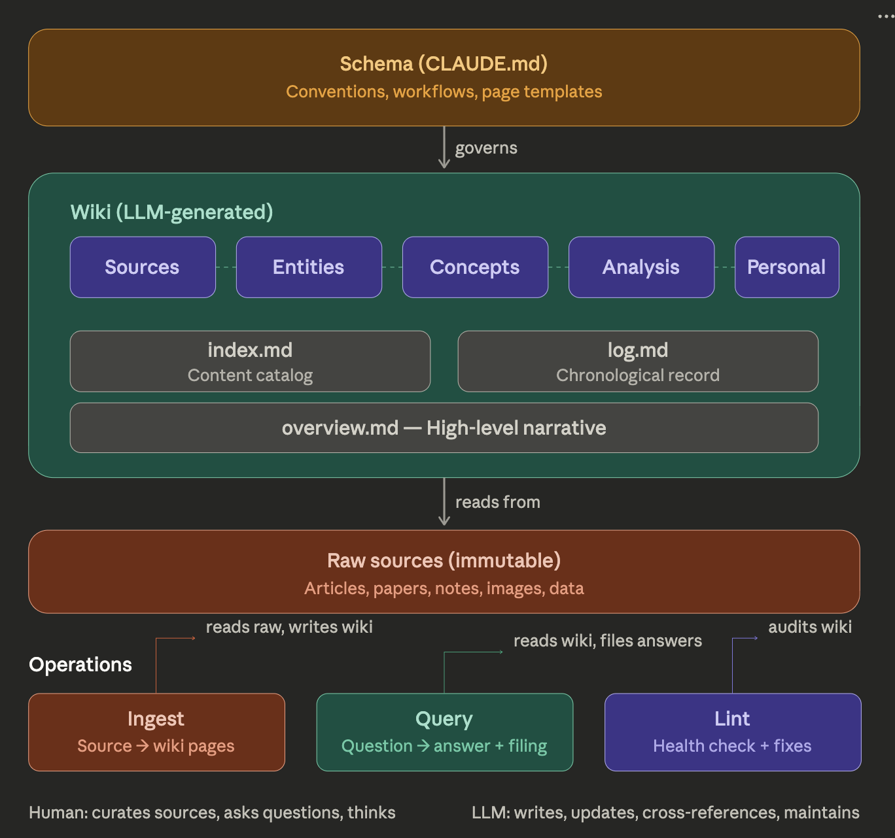

# LLM Wiki

A persistent, LLM-maintained personal knowledge base — based on [Andrej Karpathy's LLM Wiki pattern](https://gist.github.com/karpathy/442a6bf555914893e9891c11519de94f).

## What is this?

Instead of RAG-style retrieval that re-derives answers from raw documents on every query, this project uses an LLM agent to **incrementally build and maintain a structured wiki**. When you add a new source, the LLM reads it, writes a summary, updates entity and concept pages, maintains cross-references, and flags contradictions — all automatically. The knowledge compounds over time.

You curate sources, ask questions, and think. The LLM does the summarizing, cross-referencing, filing, and bookkeeping.



## Directory structure

```
raw/              # Source documents (immutable — never modify)
raw/assets/       # Images and attachments from sources
wiki/             # LLM-generated markdown pages
  sources/        # One summary per ingested source
  entities/       # People, organizations, products, places
  concepts/       # Ideas, frameworks, theories, recurring themes
  analysis/       # Filed answers from queries and synthesis
  personal/       # Goals, reflections, patterns, decisions
  index.md        # Content catalog — updated on every ingest
  log.md          # Chronological activity log
  overview.md     # High-level narrative of the wiki
prompts/          # Reference prompts and idea documents
CLAUDE.md         # Schema — conventions, page templates, workflows
```

## Prerequisites

- **LLM agent** — [Claude Code](https://docs.anthropic.com/en/docs/claude-code), OpenAI Codex, or any agent that can read/write local files
- **Obsidian** (recommended) — for browsing the wiki, graph view, and plugins

## Getting started

1. Clone this repo
2. Drop source documents (articles, papers, notes) into `raw/`
3. Open a session with your LLM agent in this directory
4. Ask the agent to ingest a source:
   ```
   Ingest raw/my-article.md
   ```
5. Browse the results in Obsidian — follow links, check the graph view

The schema in [`CLAUDE.md`](CLAUDE.md) tells the LLM how to structure pages, maintain cross-references, and run workflows. Customize it to fit your domain.

## Workflows

### Ingest

Drop a source into `raw/` and tell the LLM to process it. The agent reads it, discusses key takeaways, creates a source summary, updates entity/concept pages, and appends to the index and log. A single source can touch 10–15 wiki pages.

### Query

Ask questions against the wiki. The LLM reads the index to find relevant pages, synthesizes an answer with `[[wiki-link]]` citations, and optionally files substantial answers as analysis pages so they compound in the knowledge base.

### Lint

Periodically ask the LLM to health-check the wiki: orphan pages, broken links, stale claims, missing cross-references, contradictions between pages, and gaps worth investigating.

## Page types

| Type | Directory | Description |
|------|-----------|-------------|
| Source summary | `wiki/sources/` | One page per ingested source with key claims and connections |
| Entity | `wiki/entities/` | People, orgs, products, places — synthesized across sources |
| Concept | `wiki/concepts/` | Ideas, frameworks, themes — with tensions between views |
| Analysis | `wiki/analysis/` | Filed answers from queries, comparisons, synthesis |
| Personal | `wiki/personal/` | Goals, reflections, patterns, decisions, health tracking |

All pages use YAML frontmatter and Obsidian-style `[[wiki-links]]`. See [`CLAUDE.md`](CLAUDE.md) for full page templates.

## Use cases

- **Research** — deep-dive a topic over weeks; papers, articles, and reports compile into an evolving thesis
- **Reading a book** — file each chapter, build pages for characters, themes, plot threads
- **Personal knowledge** — goals, health, psychology, self-improvement tracked over time
- **Business/team** — internal wiki fed by meeting transcripts, Slack threads, project docs
- **Due diligence, competitive analysis, course notes, hobby deep-dives**

## Tips

- **[Obsidian Web Clipper](https://obsidian.md/clipper)** — browser extension that converts web articles to markdown for `raw/`
- **Graph view** — best way to see the wiki's shape, hubs, and orphans
- **[Dataview](https://blacksmithgu.github.io/obsidian-dataview/)** — query YAML frontmatter across pages for dynamic tables and lists
- **[Marp](https://marp.app/)** — generate slide decks from wiki content
- **Git** — the wiki is just markdown files; you get version history and branching for free

## Credits

Based on the [LLM Wiki](https://gist.github.com/karpathy/442a6bf555914893e9891c11519de94f) pattern by [Andrej Karpathy](https://github.com/karpathy).
